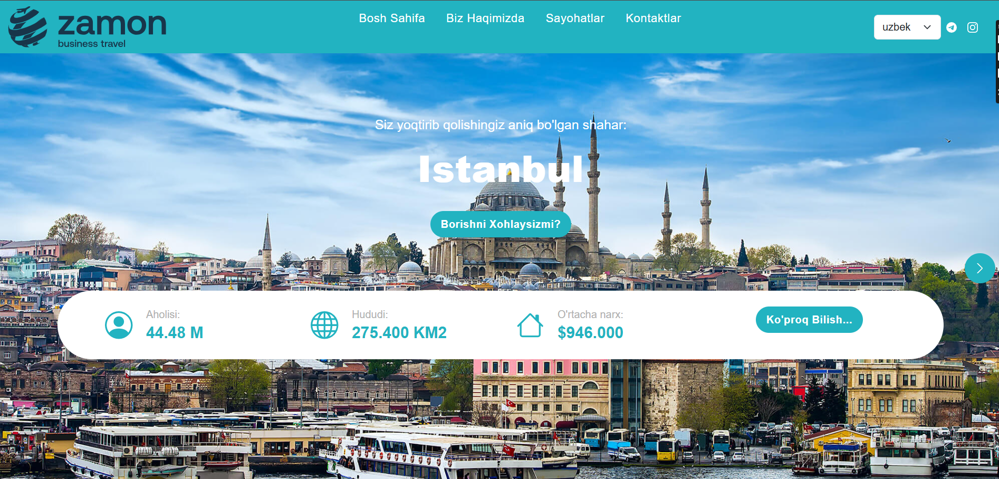

# 🌍 Zamon Tour Travel ✈️  

  

## 📌 About the Project  
**Zamon Tour Travel** is a modern web application designed for travel agencies, allowing users to explore, book, and learn more about various travel packages. Built with **ReactJS**, the platform features a **responsive design** and **multi-language support**, providing an intuitive and seamless user experience.  

🔗 **Live Demo:** [travel.suvonov-javohir.uz](https://travel.suvonov-javohir.uz/)  

---

## 🚀 Technologies Used  
This project was developed using the following technologies:  

✅ **Frontend:**  
- **HTML5** – Semantic web elements  
- **CSS3** – Modern styling and animations  
- **SASS** – Scalable and maintainable styles  
- **JavaScript (ES6+)** – Dynamic functions and API interactions  
- **ReactJS** – Component-based UI development  
- **Bootstrap CSS** – Fast and responsive design  

✅ **Additional Libraries:**  
- **I18next** – Multi-language support  
- **SwiperJS** – Interactive image sliders  
- **React Router** – Smooth navigation between pages  

---

## 🎯 Key Features  
🔹 **Multi-language support** – Users can switch between different languages using I18next.  
🔹 **Travel Packages** – Detailed information about each tour package is available.  
🔹 **Dynamic Search & Filtering** – Users can easily find their desired travel destination.  
🔹 **Responsive Design** – Fully optimized for all devices.  
🔹 **API Integration** – Dynamic data retrieval and updates.  
🔹 **Styled with Bootstrap & SASS** – Modular and easy-to-manage design.  

---

## 🛠 Installation & Setup  
To run the project locally, follow these steps:  

1️⃣ **Clone the repository:**  
```bash
git clone https://github.com/javohir-tech/ZamonTour.git
cd ZamonTour
